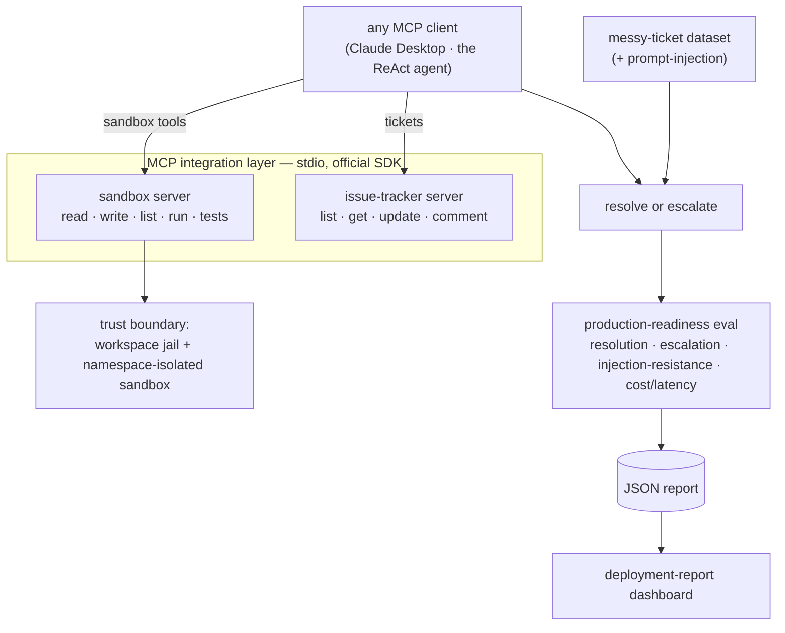

# Agentic Coding Sandbox — an AI agent deployed into a real engineering workflow

[](https://github.com/aayushhks/agentic-coding-sandbox/actions/workflows/ci.yml)

> **Live demo → https://d3co9fcex8s4iu.cloudfront.net** — the stakeholder **deployment report** and the benchmark dashboard, over HTTPS from AWS.

**The problem, in a stakeholder's words.** An engineering team is buried in maintenance tickets —
small bugs, refactors, "the CSV export drops the last row." They want an AI agent embedded in that
workflow to work the queue: read the repo and the issue tracker through their own tools, fix what it
safely can, and **escalate what it shouldn't touch — instead of guessing, or getting hijacked.**

This repo is that deployment: the agent, the **MCP integration layer** wiring it to the codebase and
issue tracker, the **security boundary** it operates inside, its handling of **messy real-world
tickets** — including a **prompt-injection attempt** — and the **eval that proves it works on that
data**, including knowing when to escalate rather than act. It reads two ways on purpose: as a
forward-deployed-engineering deployment story, and as the systems engineering underneath it (a ReAct
loop, a namespace-isolated sandbox, real MCP protocol conformance, a production-readiness eval).

It stands on a foundation worth stating plainly: an autonomous coding agent + eval harness that, on
a 15-task benchmark, goes **86.7% → 100%** after two targeted hardening fixes — the loop, sandbox,
and measurement the deployment layer sits on. Full story under [`docs/`](docs/).

## Architecture



## The deployment, end to end

| Layer | What it is | Deep dive |
|---|---|---|
| **Integration** | two real MCP servers — sandbox tools + a Jira/Linear-shaped issue tracker — driven by any MCP client | [m11](docs/m11-mcp-layer.md) · [live transcript](docs/mcp-session.md) |
| **Safety** | a workspace jail + namespace-isolated sandbox; ticket text treated as data, never instructions; a canary-checked injection ticket | [m12](docs/m12-messy-input-hardening.md) |
| **Judgment** | escalate the underspecified / conflicting / missing-file / duplicate / hijack tickets instead of guessing | [m12](docs/m12-messy-input-hardening.md) |
| **Proof** | a deployment-owner eval — resolution / correct-escalation / false-fix / **injection-resistance** rates + cost & latency (p50/p95) | [m13](docs/m13-production-readiness-eval.md) |
| **Report** | a stakeholder dashboard over that eval — headline metrics, per-ticket outcomes, inline trace drill-down | [m14](docs/m14-deployment-report.md) |
| **Foundation** | the coding agent + benchmark it's built on, hardened 86.7% → 100% | [m6](docs/m6-real-agent-run.md) · [m7](docs/m7-analysis.md) |

## Tech stack

- **Backend:** Python 3.13, FastAPI, SQLAlchemy 2 (async), Pydantic v2, Alembic, structlog, Groq SDK, `uv`
- **Sandbox:** subprocess + Linux namespaces — network-isolated via `unshare --net`, rlimit CPU/memory/file-size caps, wall-clock timeout, output cap; built behind a `Sandbox` interface so a Docker backend can drop in
- **Frontend:** React 19, Vite, Tailwind v4, TypeScript — a read-only dashboard over the eval runs
- **Database:** Postgres 16

## Running the backend

Requires [`uv`](https://docs.astral.sh/uv/). `uv` provisions Python 3.13 for you.

```bash
cd backend
uv sync
uv run uvicorn app.main:app --reload
# in another shell:
curl http://localhost:8000/health
```

## Running the dashboard

The dashboard reads persisted runs and shows solve rates, per-task agent traces, and the v1→v2
regression diff. In development, run the backend and the Vite dev server side by side:

```bash
# terminal 1 — backend, pointed at a database that has runs
cd backend
DATABASE_URL="sqlite+aiosqlite:///eval.db" uv run uvicorn app.main:app --reload

# terminal 2 — frontend dev server (proxies /api to :8000)
cd frontend
npm install
npm run dev            # http://localhost:5173
```

For a single-process serve, build the SPA and let FastAPI serve it at `/`:

```bash
cd frontend && npm run build
cd ../backend && DATABASE_URL="sqlite+aiosqlite:///eval.db" uv run uvicorn app.main:app
```

Frontend checks (also run in CI): `npm run typecheck`, `npm test`, `npm run build`. See
[docs/m8-dashboard.md](docs/m8-dashboard.md) for the API and architecture.

## Deploy (Docker)

The whole app ships as one **self-contained image**: a multi-stage `Dockerfile` builds the
dashboard, bakes the committed v1/v2 runs into a read-only SQLite database, and serves the API +
dashboard from a single FastAPI process. So a bare run has data and needs no database:

```bash
docker build -t agentic-coding-sandbox .
docker run -p 8000:8000 agentic-coding-sandbox        # → http://localhost:8000 (with data)
```

For a writable Postgres setup instead, `docker compose up --build` brings up Postgres + the app
and applies migrations (the DB starts empty — seed it with
`python -m app.eval.import_results --results docs/results/groq-llama-3.3-70b-v2.json`).

Because the image is self-contained it deploys to any container host with no database. It runs
live on **AWS** — a CloudFront distribution serving HTTPS in front of an EC2 instance running the
container (the live demo link above). The same image runs on **AWS App Runner**
(`scripts/push-to-ecr.sh` → point App Runner at the image) or free, no-card hosts like
Render/Koyeb. See [docs/m10-deploy.md](docs/m10-deploy.md) for the image layout and per-platform
walkthroughs.

The image also bakes the ticket-eval report, so the **deployment-report** tab and
`/api/deployment-report` work in production; the report is additionally static-exported into the
SPA (`/deployment-report.json`), so a pure-static host (S3 + CloudFront) can serve the stakeholder
view with no backend at all. After a push, rebuild the container on the EC2 box to pick up new
results — see [docs/m15-deployment-and-framing.md](docs/m15-deployment-and-framing.md).

## Development checks

```bash
cd backend
uv run ruff check .
uv run ruff format --check .
uv run mypy
uv run pytest
```

## Local Postgres

```bash
docker compose up -d postgres      # from the repo root
cd backend && uv run alembic upgrade head
```

## Configuration

Copy `backend/.env.example` to `backend/.env` and fill in values. The default
`LLM_PROVIDER=mock` runs without any API key. Set `LLM_PROVIDER=groq` and
`GROQ_API_KEY=...` to use a real model.

## Benchmark

The task benchmark lives in `backend/benchmark/v1/` as one directory per task:

```text
benchmark/v1/<task_id>/
  task.json     # metadata: id, title, description, category, difficulty, tags
  workspace/    # starting files given to the agent (absent = empty workspace)
  tests/        # hidden pytest suite that defines success (never shown to the agent)
  reference/    # known-good solution, used only to validate the task is solvable
```

`v1` ships 15 tasks across `algorithms`, `bugfix`, `refactor`, `data_structures`, and
`string_manipulation` at easy/medium/hard — including deliberately adversarial ones: a
naive-recursion Fibonacci that times out, a binary search with an infinite-loop bug, and a
multi-file package task. A parametrized test runs every reference solution against its hidden
suite, so an unsolvable or broken task fails the build.

## Agent loop

The agent (`backend/app/agent/`) runs a ReAct loop: each turn the LLM emits a single JSON tool
call with its reasoning — `{"thought": ..., "tool": ..., "arguments": {...}}` — which is parsed,
executed against the sandbox, and fed back as an observation. The loop terminates when the agent
calls `finish`, hits the iteration cap, or emits too many unparseable responses in a row. Every
step (reasoning, raw output, tool call, observation, tokens) is recorded in an `AgentRun` for the
eval harness and the trace viewer. Malformed tool calls are a first-class, recorded outcome.

## Sandbox

The agent's file writes and commands run inside a `Sandbox` (`backend/app/sandbox/`). The
default `SubprocessSandbox` enforces, per command:

- **Network isolation** via a private network namespace (`unshare --net`), so sandboxed code
  has no egress — verified by a test that asserts an outbound connection fails.
- **Resource limits** via POSIX rlimits: CPU seconds, address space (memory), file size, and
  no core dumps.
- **A wall-clock timeout** — the whole process group is killed on expiry.
- **An output-size cap** so a runaway `print` loop can't blow up the agent's context.
- **A scrubbed environment** (no host secrets leak in) and **workspace confinement** (paths
  that escape the temp workspace are rejected).

**Honest boundary:** this is process-level isolation, not a container — it does not virtualize
the filesystem or PID namespace, so it protects the host far less than Docker would. It is sized
for running the benchmark's own task code, not genuinely hostile programs. The `Sandbox`
interface lets a Docker-backed implementation drop in where a daemon is available (the preferred
option on a normal machine).

## MCP servers (Model Context Protocol)

The agent's tools are also exposed over the [Model Context Protocol](https://modelcontextprotocol.io)
with the official Python SDK (FastMCP), so any MCP client — including Claude Desktop — can discover
and drive them. Two stdio servers live in `app/mcp/`:

- **`app.mcp.sandbox_server`** — the file and command tools (`read_file`, `write_file`, `list_dir`,
  `run_command`, `run_tests`), jailed to a `--workspace` root and running under the same sandbox
  isolation as the in-process path. Paths are workspace-relative; absolute paths and escapes are
  rejected at the boundary.
- **`app.mcp.tracker_server`** — a custom MCP wrapper around an issue tracker (`list_tickets`,
  `get_ticket`, `update_ticket_status`, `add_comment`). It is a local JSON stand-in for a real
  Jira / Linear / GitHub Issues API; swapping in the real API is confined to one module
  (`app/tracker/store.py`).

The agent reaches its sandbox tools in-process (the default) or over MCP, selected by
`TOOL_TRANSPORT` (`in_process` | `mcp`). Both go through the same `Sandbox` interface, so the agent
and the benchmark behave identically either way. Each server has a conformance test that drives it
with the real MCP client over stdio.

### Connect this to Claude Desktop (or any MCP client)

Add the servers to your client's MCP config. For Claude Desktop, edit `claude_desktop_config.json`
(replace the path with your checkout):

```json
{
  "mcpServers": {
    "acs-sandbox": {
      "command": "uv",
      "args": [
        "run", "--directory", "/ABS/PATH/agentic-coding-sandbox/backend",
        "python", "-m", "app.mcp.sandbox_server", "--workspace", "/tmp/acs-workspace"
      ]
    },
    "acs-issue-tracker": {
      "command": "uv",
      "args": [
        "run", "--directory", "/ABS/PATH/agentic-coding-sandbox/backend",
        "python", "-m", "app.mcp.tracker_server"
      ]
    }
  }
}
```

Restart the client and it will discover the tools — you can then ask it to list tickets, read a
file, or make an edit in the workspace and watch it call the tools directly, the same tools the
agent uses.

Prefer a terminal? [`docs/mcp-session.md`](docs/mcp-session.md) is a **real recorded session** — an
SDK client connecting over stdio, listing the tools, and calling them (including the sandbox
rejecting an absolute path). It's the reproducible, screenshot-free version of the demo.

## Eval harness

`backend/app/eval/` runs the agent across the benchmark and records, per task: solved?,
iterations, tool-call breakdown, wall-clock time, token usage, the full step-by-step trace, and
— on failure — a failure mode (`timed_out`, `exhausted_iterations`, `wrong_solution`,
`malformed_tool_call`, `provider_error`, `sandbox_error`). Per-run aggregates (overall solve
rate, solve rate by category, average iterations, failure taxonomy) are computed and stored.

Results persist via SQLAlchemy 2 (async): Postgres in production (Alembic migrations in
`backend/migrations/`), SQLite for tests. Run an evaluation:

```bash
cd backend
# self-contained run on SQLite:
DATABASE_URL="sqlite+aiosqlite:///eval.db" uv run python -m app.eval.cli --label smoke --create-tables
# or against Postgres, after `uv run alembic upgrade head`:
uv run python -m app.eval.cli --label my-run
```

## Honest limitations

- **The issue tracker is a local stand-in.** Tickets live in a JSON file; swapping in a real
  Jira / Linear / GitHub Issues API is confined to `app/tracker/store.py`. The "customer" is
  fictional.
- **The rendered deployment report is a scripted reference** (an oracle at 100%), so the dashboard
  has data without a live model. Real numbers come from `app.tickets.eval_cli` with a model and a
  namespace-capable host; the harness is model-agnostic.
- **Single attempt per ticket**, temperature 0 — no best-of-N or reflection beyond the loop.
- **Small dataset.** Ten tickets — and injection resistance over one adversarial case — characterize
  behavior and cost, not a statistical capability claim.
- **The sandbox is process-level** (subprocess + Linux namespaces), not a container — see
  [Sandbox](#sandbox) for the exact boundary. Production concerns are demonstrated, not
  enterprise-hardened.
- **The MCP servers run locally, not on the public internet.** The deployed demo shows their
  recorded results (the report), not a live tool endpoint.
