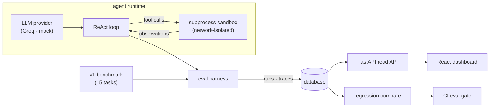

# Agentic Coding Sandbox + Eval Harness

An autonomous coding agent that, given a programming task, writes code, runs it in an
isolated sandbox, observes the result, and iterates until the task's tests pass — paired
with an eval harness that measures how well the agent performs across a benchmark of tasks.

This is a portfolio project built to demonstrate the engineering behind agentic systems:
the control loop, the tool interface, the sandboxing, the failure modes, and how to measure
whether the agent is actually any good. It is the companion to `llm-eval-with-probes` — that
project evaluates LLMs; this one builds and evaluates an autonomous agent.

**Result:** on the 15-task `v1` benchmark the agent (Llama 3.3 70B via Groq) goes from
**86.7% → 100%** after two targeted hardening fixes, with the full story — runs, traces,
figures, and a regression gate — written up under [`docs/`](docs/).

## Status

Built in ten milestones, **all complete** — from scaffold to a deployable dashboard guarded by a CI eval gate.

- [x] M1 — scaffold: FastAPI skeleton, health endpoint, LLM provider abstraction (Groq + mock), CI
- [x] M2 — tool interface + sandbox: tool schema + subprocess sandbox (namespace network isolation, rlimits, timeout, output cap)
- [x] M3 — agent loop: ReAct loop (JSON tool-call protocol, parsing, observation formatting, iteration + malformed caps), tested against the mock provider
- [x] M4 — task benchmark: 15 versioned tasks across 5 categories with hidden pytest suites, a loader, a single-task runner, and reference-solution validation
- [x] M5 — eval runner + persistence: full-benchmark harness, failure taxonomy, SQLAlchemy 2 async persistence + Alembic, results CLI
- [x] M6 — real agent run: first full benchmark on Llama 3.3 70B (Groq) — **86.7% solve rate (13/15)**, both failures on hard tasks; write-up + failure analysis in [docs/m6-real-agent-run.md](docs/m6-real-agent-run.md)
- [x] M7 — hardening analysis: two targeted fixes (balanced-brace tool-call parser + verified-finish gate) lift the `v1` benchmark from 86.7% to **100% (15/15)** with zero regressions; v1→v2 diff, figures, and trace-level evidence in [docs/m7-analysis.md](docs/m7-analysis.md)
- [x] M8 — eval dashboard: FastAPI read API + React 19 / Vite / Tailwind v4 SPA over the persisted runs — solve rates, per-task agent traces, and an interactive v1↔v2 regression diff; details in [docs/m8-dashboard.md](docs/m8-dashboard.md)
- [x] M9 — CI eval gate: a regression gate (`app.eval.gate_cli`) that fails when a candidate run regresses against the committed baseline or drops below a solve-rate floor — per-push unit coverage in `ci.yml`, a real-model run on schedule/dispatch in `eval-gate.yml`; details in [docs/m9-ci-eval-gate.md](docs/m9-ci-eval-gate.md)
- [x] M10 — docs & deploy: multi-stage Docker image (one FastAPI process serves the API **and** the built SPA) + a compose stack with Postgres; architecture overview and deploy notes in [docs/m10-deploy.md](docs/m10-deploy.md)

## Architecture



## Tech stack

- **Backend:** Python 3.13, FastAPI, SQLAlchemy 2 (async), Pydantic v2, Alembic, structlog, Groq SDK, `uv`
- **Sandbox:** subprocess + Linux namespaces — network-isolated via `unshare --net`, rlimit CPU/memory/file-size caps, wall-clock timeout, output cap; built behind a `Sandbox` interface so a Docker backend can drop in
- **Frontend:** React 19, Vite, Tailwind v4, TypeScript — a read-only dashboard over the eval runs
- **Database:** Postgres 16

## Running the backend (M1)

Requires [`uv`](https://docs.astral.sh/uv/). `uv` provisions Python 3.13 for you.

```bash
cd backend
uv sync
uv run uvicorn app.main:app --reload
# in another shell:
curl http://localhost:8000/health
```

## Running the dashboard (M8)

The dashboard reads persisted runs and shows solve rates, per-task agent traces, and the M7
regression diff. In development, run the backend and the Vite dev server side by side:

```bash
# terminal 1 — backend, pointed at a database that has runs
cd backend
DATABASE_URL="sqlite+aiosqlite:///eval.db" uv run uvicorn app.main:app --reload

# terminal 2 — frontend dev server (proxies /api to :8000)
cd frontend
npm install
npm run dev            # http://localhost:5173
```

For a single-process serve, build the SPA and let FastAPI serve it at `/`:

```bash
cd frontend && npm run build
cd ../backend && DATABASE_URL="sqlite+aiosqlite:///eval.db" uv run uvicorn app.main:app
```

Frontend checks (also run in CI): `npm run typecheck`, `npm test`, `npm run build`. See
[docs/m8-dashboard.md](docs/m8-dashboard.md) for the API and architecture.

## Deploy (Docker)

The whole app ships as one image: a multi-stage `Dockerfile` builds the dashboard and then
serves it together with the API from a single FastAPI process. `docker compose up` brings up
Postgres and the app, applies migrations, and serves on port 8000:

```bash
docker compose up --build           # from the repo root → http://localhost:8000
```

A fresh database starts empty (the dashboard shows an empty state); populate it by running an
evaluation against the same `DATABASE_URL`, or seed it from a committed results file with
`python -m app.eval.import_results --results docs/results/groq-llama-3.3-70b-v2.json`.

To host the pieces separately — dashboard on Vercel, API + Postgres on Railway — the repo is
ready for it (configurable API base URL, CORS, `$PORT`, async-URL coercion, `railway.json`,
`frontend/vercel.json`). See [docs/m10-deploy.md](docs/m10-deploy.md) for the image layout, the
single-process and split-deploy walkthroughs, and how to seed data.

## Development checks

```bash
cd backend
uv run ruff check .
uv run ruff format --check .
uv run mypy
uv run pytest
```

## Local Postgres

```bash
docker compose up -d postgres      # from the repo root
cd backend && uv run alembic upgrade head
```

## Configuration

Copy `backend/.env.example` to `backend/.env` and fill in values. The default
`LLM_PROVIDER=mock` runs without any API key. Set `LLM_PROVIDER=groq` and
`GROQ_API_KEY=...` to use a real model.

## Benchmark

The task benchmark lives in `backend/benchmark/v1/` as one directory per task:

```text
benchmark/v1/<task_id>/
  task.json     # metadata: id, title, description, category, difficulty, tags
  workspace/    # starting files given to the agent (absent = empty workspace)
  tests/        # hidden pytest suite that defines success (never shown to the agent)
  reference/    # known-good solution, used only to validate the task is solvable
```

`v1` ships 15 tasks across `algorithms`, `bugfix`, `refactor`, `data_structures`, and
`string_manipulation` at easy/medium/hard — including deliberately adversarial ones: a
naive-recursion Fibonacci that times out, a binary search with an infinite-loop bug, and a
multi-file package task. A parametrized test runs every reference solution against its hidden
suite, so an unsolvable or broken task fails the build.

## Agent loop

The agent (`backend/app/agent/`) runs a ReAct loop: each turn the LLM emits a single JSON tool
call with its reasoning — `{"thought": ..., "tool": ..., "arguments": {...}}` — which is parsed,
executed against the sandbox, and fed back as an observation. The loop terminates when the agent
calls `finish`, hits the iteration cap, or emits too many unparseable responses in a row. Every
step (reasoning, raw output, tool call, observation, tokens) is recorded in an `AgentRun` for the
eval harness and the trace viewer. Malformed tool calls are a first-class, recorded outcome.

## Sandbox

The agent's file writes and commands run inside a `Sandbox` (`backend/app/sandbox/`). The
default `SubprocessSandbox` enforces, per command:

- **Network isolation** via a private network namespace (`unshare --net`), so sandboxed code
  has no egress — verified by a test that asserts an outbound connection fails.
- **Resource limits** via POSIX rlimits: CPU seconds, address space (memory), file size, and
  no core dumps.
- **A wall-clock timeout** — the whole process group is killed on expiry.
- **An output-size cap** so a runaway `print` loop can't blow up the agent's context.
- **A scrubbed environment** (no host secrets leak in) and **workspace confinement** (paths
  that escape the temp workspace are rejected).

**Honest boundary:** this is process-level isolation, not a container — it does not virtualize
the filesystem or PID namespace, so it protects the host far less than Docker would. It is sized
for running the benchmark's own task code, not genuinely hostile programs. The `Sandbox`
interface lets a Docker-backed implementation drop in where a daemon is available (the preferred
option on a normal machine; this cloud build environment has no usable daemon).

## Eval harness

`backend/app/eval/` runs the agent across the benchmark and records, per task: solved?,
iterations, tool-call breakdown, wall-clock time, token usage, the full step-by-step trace, and
— on failure — a failure mode (`timed_out`, `exhausted_iterations`, `wrong_solution`,
`malformed_tool_call`, `provider_error`, `sandbox_error`). Per-run aggregates (overall solve
rate, solve rate by category, average iterations, failure taxonomy) are computed and stored.

Results persist via SQLAlchemy 2 (async): Postgres in production (Alembic migrations in
`backend/migrations/`), SQLite for tests. Run an evaluation:

```bash
cd backend
# self-contained run on SQLite:
DATABASE_URL="sqlite+aiosqlite:///eval.db" uv run python -m app.eval.cli --label smoke --create-tables
# or against Postgres, after `uv run alembic upgrade head`:
uv run python -m app.eval.cli --label my-run
```

## Limitations

Stated plainly, and expanded as the project grows:

- The benchmark will be small (15–25 tasks) — enough to characterize behavior and failure
  modes, not a statistical claim about agent capability in general.
- The agent uses a free-tier model (Llama 3.3 70B via Groq), weaker than frontier models.
  The harness is model-agnostic, so swapping in a stronger model is a config change.
- The sandbox is process-level (subprocess + Linux namespaces), not a container — see
  [Sandbox](#sandbox) for the exact boundary. A Docker backend fits behind the same interface.
- Single attempt per task — no best-of-N sampling or reflection beyond the core loop.
