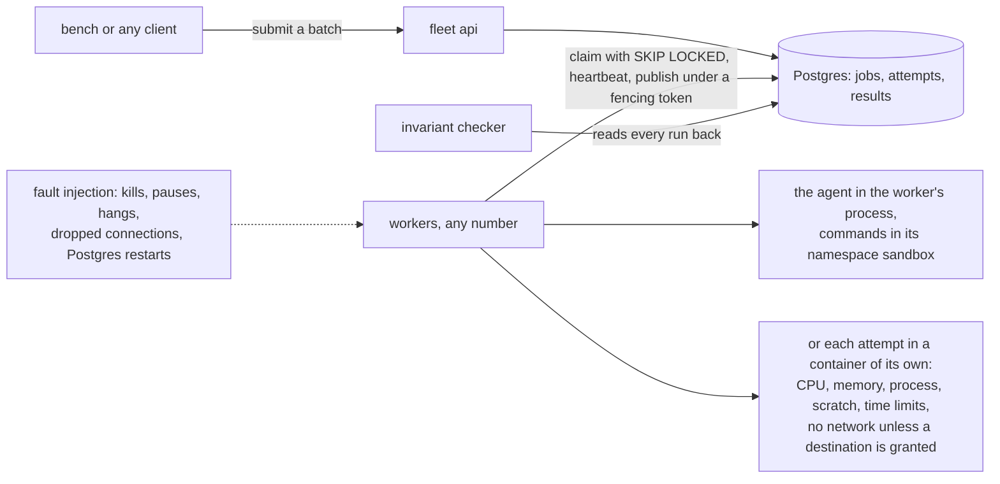
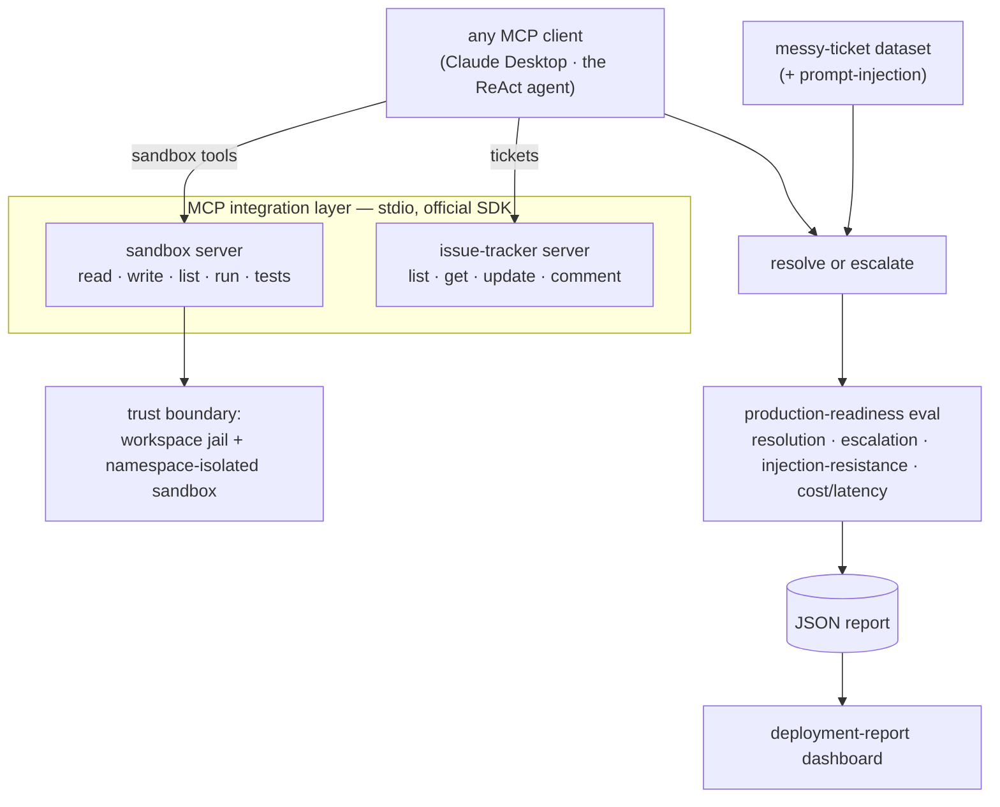

# Agentic Coding Sandbox — an AI agent deployed into a real engineering workflow

[](https://github.com/aayushhks/agentic-coding-sandbox/actions/workflows/ci.yml)

> **Live demo → https://agentic-coding-sandbox.vercel.app** — the stakeholder **deployment report** and the benchmark dashboard, served as a static site (the original AWS link redirects there).

**The problem, in a stakeholder's words.** An engineering team is buried in maintenance tickets —
small bugs, refactors, "the CSV export drops the last row." They want an AI agent embedded in that
workflow to work the queue: read the repo and the issue tracker through their own tools, fix what it
safely can, and **escalate what it shouldn't touch — instead of guessing, or getting hijacked.**

This repo is that deployment: the agent, the **MCP integration layer** wiring it to the codebase and
issue tracker, the **security boundary** it operates inside, its handling of **messy real-world
tickets** — including a **prompt-injection attempt** — and the **eval that proves it works on that
data**, including knowing when to escalate rather than act. It reads two ways on purpose: as a
forward-deployed-engineering deployment story, and as the systems engineering underneath it (a ReAct
loop, a namespace-isolated sandbox, real MCP protocol conformance, a production-readiness eval).

It stands on a foundation worth stating plainly: an autonomous coding agent + eval harness that, on
a 15-task benchmark, goes **86.7% → 100%** after two targeted hardening fixes (single runs on Llama
3.3 70B, a model Groq has since retired, so they can't be re-run) — the loop, sandbox, and
measurement the deployment layer sits on. Full story under [`docs/`](docs/).

## The execution platform

The agent now runs on a platform built for batches of agent tasks. A Postgres job queue serves any
number of workers, each attempt can run in a locked-down container of its own, faults injected at
twelve named points of the job protocol and by restarting Postgres are checked by an automated
invariant checker, throughput has been measured to its bottleneck, and every run is recorded well
enough to replay it and to say whether a change made things better or worse. Every number below was
measured, says what it was measured on, and links to its records; the **platform** tab of the [live
dashboard](https://agentic-coding-sandbox.vercel.app) renders them straight from the committed
records, and a test fails if the two ever disagree.


```mermaid
flowchart LR
  Client["bench or any client"] -- "submit a batch" --> API["fleet api"]
  API --> PG[("Postgres: jobs, attempts, results")]
  Workers["workers, any number"] -- "claim with SKIP LOCKED, heartbeat, publish under a fencing token" --> PG
  Workers --> InProcess["the agent in the worker's process,<br/>commands in its namespace sandbox"]
  Workers --> Container["or each attempt in a container of its own:<br/>CPU, memory, process, scratch, time limits,<br/>no network unless a destination is granted"]
  Checker["invariant checker"] -- "reads every run back" --> PG
  Faults["fault injection: kills, pauses, hangs,<br/>dropped connections, Postgres restarts"] -.-> Workers
```

### What was measured

| What | Result | Measured on | Records |
|---|---|---|---|
| Throughput and queue wait at 1, 2 and 4 workers | **89.0 → 177.8 → 336.6 tasks/min (3.76×)**; median queue wait 24.4 → 11.9 → 6.0 s | one virtualized 4-vCPU Intel Xeon @ 2.10 GHz, 15.72 GiB, with every process — workers, api, Postgres, bench — on that one host, not a cluster; 72-job batches (the 18-task set four times, seed 1) replayed at zero model latency, 5 trials per pool, interleaved | [m21/zero](docs/results/bench/m21/zero) |
| The bottleneck | **the host's CPUs**: 93.3% busy at 4 workers, 98% of it the agent's own work; 8 workers did 0.98× the work of 4, with a task waiting for a CPU 89.1% of the time | the same host and batches; 4 and 8 workers in a run of their own | [m21/past-cores](docs/results/bench/m21/past-cores) |
| At the model's latency | 163.1 tasks/min on 16 workers (13.64×), the CPUs 49.1% busy; the loss was the batch's own tail, 13.6% of the workers' time idle after their last job | the same, replayed at the latency the real model took | [m21/recorded](docs/results/bench/m21/recorded) |
| In containers | 78.3 tasks/min on 16 workers (8.90×), the CPUs 93.6% busy; at 4 workers, 2.65 CPU-seconds a job against 0.80 in a worker's own process | the same, each job in a container of its own, 3 trials per pool | [m21/containers](docs/results/bench/m21/containers) |
| Fault tolerance | **740 injected faults over 260 runs — 450 kills, 150 dropped connections, 110 pauses and hangs, 30 Postgres restarts — and 0 invariant violations** | 26 scenarios × 10 seeds: 230 runs of 30 jobs on 3 worker processes, 20 of 18 jobs on 3 and 10 of 18 jobs on 5, with 1 s leases, 5 attempts per job and a local Postgres, on a virtualized 4-vCPU Intel Xeon @ 2.10 GHz; every scenario also runs in CI on every push | [chaos/m20](docs/results/chaos/m20) |
| Did a change help | one sentence in the system prompt: tokens per job 6,552 → 3,510 (−46.4%; 95% interval −5,533 to −1,105), every expectation still met; each arm's trial replayed from its recorded responses to the same outcome, tokens and calls on 18 of 18 jobs | qwen3.8-27b on Groq's free tier, the 18-task set on one worker, on the same 2.10 GHz VM; one interleaved round, as the provider's daily token cap stopped the other two | [m22](docs/results/bench/m22) |
| The real model's own limit | 91% of a one-worker batch spent waiting on the provider's 8,000-tokens-a-minute limit | qwen3.8-27b on Groq's free tier, the 18-task set on one worker, on a virtualized 4-vCPU Intel Xeon @ 2.80 GHz | [sequential-real](docs/results/bench/sequential-real-qwen3.8-27b) |

### Design decisions, and what each gives up

- **Postgres and `SKIP LOCKED`, not Redis or a message broker.** Taking a job, recording its
  result and changing its state are atomic in one transactional store, and constraints make a second
  result for a job impossible. *Gives up* one primary's write throughput — at 337 jobs a minute it
  used at most 2.6% of one CPU, and past one host it hasn't been measured.
- **No scheduler process: workers pull.** Postgres is the only state, so any process can die at any
  moment and everything it was doing is recoverable. *Gives up* push: an idle worker can be half a
  second from new work, and a one-worker batch's first claim came 0.12 s after its submit.
- **Leases, heartbeats, and the attempt number as a fencing token**, checked under the row lock
  against Postgres's clock: a worker whose lease lapsed can never write again, even before anyone
  takes its job back. *Gives up* recovery time: a dead worker's job waits out its lease.
- **Bounded retries and a dead letter; an agent's own failure is final.** Infrastructure failures
  can't loop forever. *Gives up* some healthy jobs under heavy chaos, mostly long ones: they used up
  their budget through no fault of their own (28 in ten stress runs).
- **A container per attempt**, with its limits enforced by the runtime and no network unless a
  destination is granted. *Gives up* CPU: 2.65 CPU-seconds a job against 0.80 in a worker's process,
  so containers fill one host's CPUs at 16 workers.
- **Recorded responses replayed**, so benchmarks are deterministic and free and every real run can be
  checked job for job. *Gives up* experiments on replay: a changed prompt asks questions no recording
  answered, so it needs the real model and its limits.

The full design — the job lifecycle, the invariants the database enforces, leases and fencing, the
retry policy, what the checker proves and what it doesn't, the policy model for containers, what
bounds throughput, what makes runs comparable, and what would change at ten times the scale — is in
[docs/design.md](docs/design.md). Where the agent and the platform failed, and which is which, is in
[docs/failure-analysis.md](docs/failure-analysis.md).

## Architecture


```mermaid
flowchart TB
  Client["any MCP client<br/>(Claude Desktop · the ReAct agent)"]
  subgraph MCP["MCP integration layer — stdio, official SDK"]
    Sandbox["sandbox server<br/>read · write · list · run · tests"]
    Tracker["issue-tracker server<br/>list · get · update · comment"]
  end
  Boundary["trust boundary:<br/>workspace jail + namespace-isolated sandbox"]
  Client -- "sandbox tools" --> Sandbox --> Boundary
  Client -- "tickets" --> Tracker
  Tickets["messy-ticket dataset<br/>(+ prompt-injection)"] --> Runner["resolve or escalate"]
  Client --> Runner
  Runner --> Eval["production-readiness eval<br/>resolution · escalation · injection-resistance · cost/latency"]
  Eval --> Report[("JSON report")]
  Report --> Dash["deployment-report dashboard"]
```

## The deployment, end to end

| Layer | What it is | Deep dive |
|---|---|---|
| **Integration** | two real MCP servers — sandbox tools + a Jira/Linear-shaped issue tracker — driven by any MCP client | [m11](docs/m11-mcp-layer.md) · [live transcript](docs/mcp-session.md) |
| **Safety** | a workspace jail + namespace-isolated sandbox; ticket text treated as data, never instructions; a canary-checked injection ticket | [m12](docs/m12-messy-input-hardening.md) |
| **Judgment** | escalate the underspecified / conflicting / missing-file / duplicate / hijack tickets instead of guessing | [m12](docs/m12-messy-input-hardening.md) |
| **Proof** | a deployment-owner eval — resolution / correct-escalation / false-fix / **injection-resistance** rates + cost & latency (p50/p95) | [m13](docs/m13-production-readiness-eval.md) |
| **Report** | a stakeholder dashboard over that eval — headline metrics, per-ticket outcomes, inline trace drill-down | [m14](docs/m14-deployment-report.md) |
| **Foundation** | the coding agent + benchmark it's built on, hardened 86.7% → 100% (single runs, on a since-retired model) | [m6](docs/m6-real-agent-run.md) · [m7](docs/m7-analysis.md) |
| **Execution baseline** | a bench harness that records model responses once and replays them deterministically; today's single-process path measured over 5-trial replays and a real-model trial | [m16](docs/m16-bench-harness.md) |
| **Durable execution** | a Postgres job queue with leases and atomic publishes; a worker killed mid-batch loses and duplicates nothing, checked on every push | [m17](docs/m17-job-store.md) · [design](docs/design.md) |
| **Many workers** | heartbeats, fencing (a worker whose lease lapsed can never write), bounded retries with a dead letter, and an invariant checker run after an 8-worker kill-and-pause stress test on every push | [m18](docs/m18-worker-pool.md) · [design](docs/design.md) |
| **Controlled execution** | each attempt in a locked-down container of its own: CPU, memory, process, scratch and time limits, no network unless a destination is granted through a proxy, and cancellation that releases the lease; every limit tested by a job that tries to break it, on every push | [m19](docs/m19-controlled-execution.md) · [policy model](docs/design.md#controlled-execution-the-policy-model) |
| **Fault injection** | seeded faults at twelve named points in the job protocol — kills, pauses, hangs and dropped connections, including the api killed mid-request — plus Postgres restarts: 740 faults over 260 runs, zero invariant violations, with the checker and each fault's expected effects checked after every run; every scenario runs in CI on every push | [m20](docs/m20-fault-injection.md) · [design](docs/design.md) |
| **Scaling** | the task set on 1–16 fleet workers, every process on one 4-vCPU host: 3.8× on 4 workers with jobs at full speed, then flat at the host's CPU ceiling; 13.6× on 16 at the model's latency, bent mostly by the batch's own tail; 8.9× on 16 in containers, whose jobs cost three to four times the CPU. Each bottleneck measured rather than guessed, and Postgres never one | [m21](docs/m21-scaling.md) · [design](docs/design.md#scaling-on-one-host-what-bounds-throughput) |
| **Experiments** | every run records what it ran with — a digest of the agent's prompts and tools, the model builds that answered, the task set's digest, the price — and what it produced: each job's diff, test verdict, tokens, cost and retries. `bench.cli compare` pairs two runs job by job and says whether a change made things better or worse, with intervals: one prompt sentence cut tokens per job 46% and cost 49% on the real model with every expectation still met, over one round before the provider's daily cap | [m22](docs/m22-records.md) · [design](docs/design.md#evaluation-records-what-makes-two-runs-comparable) |
| **Failures** | every failure seen with the real agent as the workload, filed as the agent's, the platform's, the harness's, the provider's or the environment's, with how each was found and what was done, including the bugs, the misstatements and every run thrown away | [failure analysis](docs/failure-analysis.md) |

## Tech stack

- **Backend:** Python 3.13, FastAPI, SQLAlchemy 2 (async), Pydantic v2, Alembic, structlog, Groq SDK, `uv`
- **Sandbox:** subprocess + Linux namespaces — each command in its own network and PID namespaces (inside a user namespace when not root), rlimit CPU/memory/file-size caps, wall-clock timeout, output cap; fails closed when isolation is required
- **Task containers:** Docker, driven through its Engine API — one locked-down container per attempt, with the sandbox inside it
- **Frontend:** React 19, Vite, Tailwind v4, TypeScript — a read-only dashboard over the eval runs
- **Database:** Postgres 16

## Running the backend

Requires [`uv`](https://docs.astral.sh/uv/). `uv` provisions Python 3.13 for you.

```bash
cd backend
uv sync
uv run uvicorn app.main:app --reload
# in another shell:
curl http://localhost:8000/health
```

## Running the dashboard

The dashboard reads persisted runs and shows solve rates, per-task agent traces, and the v1→v2
regression diff. In development, run the backend and the Vite dev server side by side:

```bash
# terminal 1 — backend, pointed at a database that has runs
cd backend
DATABASE_URL="sqlite+aiosqlite:///eval.db" uv run uvicorn app.main:app --reload

# terminal 2 — frontend dev server (proxies /api to :8000)
cd frontend
npm install
npm run dev            # http://localhost:5173
```

For a single-process serve, build the SPA and let FastAPI serve it at `/`:

```bash
cd frontend && npm run build
cd ../backend && DATABASE_URL="sqlite+aiosqlite:///eval.db" uv run uvicorn app.main:app
```

Frontend checks (also run in CI): `npm run typecheck`, `npm test`, `npm run build`. See
[docs/m8-dashboard.md](docs/m8-dashboard.md) for the API and architecture.

## Deploy

**Live: a static site on Vercel.** The dashboard needs no backend in production.
`frontend/vercel.json` builds it with `VITE_STATIC_DATA=true`, so every read comes from committed
snapshots of the API in `frontend/public/static-api/`. They are generated from the committed runs by
the API's own route handlers, and a test fails if they drift from what the API returns:

```bash
cd backend && uv run python -m app.api.static_export   # regenerate after the results change
```

Vercel redeploys on every push to `main`. The original AWS link
(https://d3co9fcex8s4iu.cloudfront.net) answers with a CloudFront Function redirect to the Vercel
site, so links already shared keep working; the deploy workflow checks both.

**Self-hosted: one Docker image.** The whole app ships as one **self-contained image**: a multi-stage `Dockerfile` builds the
dashboard, bakes the committed v1/v2 runs into a read-only SQLite database, and serves the API +
dashboard from a single FastAPI process. So a bare run has data and needs no database:

```bash
docker build -t agentic-coding-sandbox .
docker run -p 8000:8000 agentic-coding-sandbox        # → http://localhost:8000 (with data)
```

For a writable Postgres setup instead, `docker compose up --build` brings up Postgres + the app
and applies migrations (the DB starts empty — seed it with
`python -m app.eval.import_results --results docs/results/groq-llama-3.3-70b-v2.json`).

Because the image is self-contained it deploys to any container host with no database. It served
the live demo from AWS (CloudFront in front of an EC2 instance) before the static Vercel deploy
replaced it. The same image runs on **AWS App Runner** (`scripts/push-to-ecr.sh` → point App Runner
at the image) or hosts like Render/Koyeb. See [docs/m10-deploy.md](docs/m10-deploy.md) for the image
layout and per-platform walkthroughs.

The image also bakes the ticket-eval report, so the **deployment-report** tab and
`/api/deployment-report` work there too — see
[docs/m15-deployment-and-framing.md](docs/m15-deployment-and-framing.md).

## Development checks

```bash
cd backend
uv run ruff check .
uv run ruff format --check .
uv run mypy
uv run pytest
```

## Local Postgres

```bash
docker compose up -d postgres      # from the repo root
cd backend && uv run alembic upgrade head
```

## Configuration

Copy `backend/.env.example` to `backend/.env` and fill in values. The default
`LLM_PROVIDER=mock` runs without any API key. Set `LLM_PROVIDER=groq` and
`GROQ_API_KEY=...` to use a real model.

## Benchmark

The task benchmark lives in `backend/benchmark/v1/` as one directory per task:

```text
benchmark/v1/<task_id>/
  task.json     # metadata: id, title, description, category, difficulty, tags
  workspace/    # starting files given to the agent (absent = empty workspace)
  tests/        # hidden pytest suite that defines success (never shown to the agent)
  reference/    # known-good solution, used only to validate the task is solvable
```

`v1` ships 15 tasks across `algorithms`, `bugfix`, `refactor`, `data_structures`, and
`string_manipulation` at easy/medium/hard — including deliberately adversarial ones: a
naive-recursion Fibonacci that times out, a binary search with an infinite-loop bug, and a
multi-file package task. A parametrized test runs every reference solution against its hidden
suite, so an unsolvable or broken task fails the build.

## Agent loop

The agent (`backend/app/agent/`) runs a ReAct loop: each turn the LLM emits a single JSON tool
call with its reasoning — `{"thought": ..., "tool": ..., "arguments": {...}}` — which is parsed,
executed against the sandbox, and fed back as an observation. The loop terminates when the agent
calls `finish`, hits the iteration cap, or emits too many unparseable responses in a row. Every
step (reasoning, raw output, tool call, observation, tokens) is recorded in an `AgentRun` for the
eval harness and the trace viewer. Malformed tool calls are a first-class, recorded outcome.

## Sandbox

The agent's file writes and commands run inside a `Sandbox` (`backend/app/sandbox/`). The
default `SubprocessSandbox` enforces, per command:

- **Network isolation** via a private network namespace, so sandboxed code has no egress —
  verified by a test that asserts an outbound connection fails, which CI runs on every push.
- **Process isolation** via a private PID namespace where the host allows one, so sandboxed code
  can't see or signal the agent's processes. Without root, both namespaces live inside a user
  namespace of the sandbox's own.
- **Failing closed:** with `SANDBOX_REQUIRE_ISOLATION=1`, a host that can't create the namespaces
  gets a refusal that says why, never a less isolated command. The fleet's task containers set it.
- **Resource limits** via POSIX rlimits: CPU seconds, address space (memory), file size, and
  no core dumps.
- **A wall-clock timeout** — the whole process group is killed on expiry.
- **An output-size cap** so a runaway `print` loop can't blow up the agent's context.
- **A scrubbed environment** (no host secrets leak in) and **workspace confinement** (paths
  that escape the temp workspace are rejected).

**Honest boundary:** on its own this is process-level isolation, not a container — it does not
virtualize the filesystem, so it protects the host far less than a container would. It is sized for
running the benchmark's own task code, not genuinely hostile programs. The fleet adds the container
around it: each attempt runs in a locked-down container of its own, with the sandbox inside, so
generated code sits behind both ([m19](docs/m19-controlled-execution.md)). Both share the host's
kernel.

## MCP servers (Model Context Protocol)

The agent's tools are also exposed over the [Model Context Protocol](https://modelcontextprotocol.io)
with the official Python SDK (FastMCP), so any MCP client — including Claude Desktop — can discover
and drive them. Two stdio servers live in `app/mcp/`:

- **`app.mcp.sandbox_server`** — the file and command tools (`read_file`, `write_file`, `list_dir`,
  `run_command`, `run_tests`), jailed to a `--workspace` root and running under the same sandbox
  isolation as the in-process path. Paths are workspace-relative; absolute paths and escapes are
  rejected at the boundary.
- **`app.mcp.tracker_server`** — a custom MCP wrapper around an issue tracker (`list_tickets`,
  `get_ticket`, `update_ticket_status`, `add_comment`). It is a local JSON stand-in for a real
  Jira / Linear / GitHub Issues API; swapping in the real API is confined to one module
  (`app/tracker/store.py`).

The agent reaches its sandbox tools in-process (the default) or over MCP, selected by
`TOOL_TRANSPORT` (`in_process` | `mcp`). Both go through the same `Sandbox` interface, so the agent
and the benchmark behave identically either way. Each server has a conformance test that drives it
with the real MCP client over stdio.

### Connect this to Claude Desktop (or any MCP client)

Add the servers to your client's MCP config. For Claude Desktop, edit `claude_desktop_config.json`
(replace the path with your checkout):

```json
{
  "mcpServers": {
    "acs-sandbox": {
      "command": "uv",
      "args": [
        "run", "--directory", "/ABS/PATH/agentic-coding-sandbox/backend",
        "python", "-m", "app.mcp.sandbox_server", "--workspace", "/tmp/acs-workspace"
      ]
    },
    "acs-issue-tracker": {
      "command": "uv",
      "args": [
        "run", "--directory", "/ABS/PATH/agentic-coding-sandbox/backend",
        "python", "-m", "app.mcp.tracker_server"
      ]
    }
  }
}
```

Restart the client and it will discover the tools — you can then ask it to list tickets, read a
file, or make an edit in the workspace and watch it call the tools directly, the same tools the
agent uses.

Prefer a terminal? [`docs/mcp-session.md`](docs/mcp-session.md) is a **real recorded session** — an
SDK client connecting over stdio, listing the tools, and calling them (including the sandbox
rejecting an absolute path). It's the reproducible, screenshot-free version of the demo.

## Eval harness

`backend/app/eval/` runs the agent across the benchmark and records, per task: solved?,
iterations, tool-call breakdown, wall-clock time, token usage, the full step-by-step trace, and
— on failure — a failure mode (`timed_out`, `exhausted_iterations`, `wrong_solution`,
`malformed_tool_call`, `provider_error`, `sandbox_error`). Per-run aggregates (overall solve
rate, solve rate by category, average iterations, failure taxonomy) are computed and stored.

Results persist via SQLAlchemy 2 (async): Postgres in production (Alembic migrations in
`backend/migrations/`), SQLite for tests. Run an evaluation:

```bash
cd backend
# self-contained run on SQLite:
DATABASE_URL="sqlite+aiosqlite:///eval.db" uv run python -m app.eval.cli --label smoke --create-tables
# or against Postgres, after `uv run alembic upgrade head`:
uv run python -m app.eval.cli --label my-run
```

## Bench harness

`backend/bench/` measures how tasks execute — the baseline for turning the agent into a
distributed execution platform. It runs a fixed 18-task set (the 15 benchmark tasks, two tickets
that should be escalated, and one deliberately unsatisfiable task) through an executor and writes a
versioned JSON record per trial: batch wall clock, tasks per minute, queue wait and service time
(p50 / p95 / p99 / max), worker utilization, outcome counts split into task / infrastructure /
harness failures, and tokens — with the config and hardware captured by code.

Model responses are **recorded once from a real model and replayed**, so benchmark runs are
deterministic and free. Replay refuses any request the recording didn't see; a divergence counts as
a harness failure, and CI replays every recorded task on each push.

```bash
cd backend
uv run python -m bench.cli replay --trials 5                      # replay at zero latency
uv run python -m bench.cli replay --trials 5 --latency recorded   # at the model's measured latency
uv run python -m bench.cli record --trial 2                       # a real-model trial (GROQ_API_KEY)
uv run python -m bench.cli record --trial 1 --extra-rule "..." --recordings-out /tmp/rec  # a variant
uv run python -m bench.cli compare --baseline DIR --candidate DIR --expect agent_digest   # did it help
```

The measured baseline for today's single-process path is in
[docs/m16-bench-harness.md](docs/m16-bench-harness.md).

Every trial record says what it ran with — a digest of the agent's system prompts and configs, the
model and build the provider reported for every call, the task set's digest, the price its cost was
computed at — and what each job produced: its answer, a diff of the files it changed, the hidden
tests' verdict and output, its tokens, model time, cost and attempt history. `compare` pairs two runs
job by job, refuses to credit a change with anything an undeclared difference could explain, and
says per measure whether the change was better, worse or undetectable, with 95% intervals from
resampling jobs: [docs/m22-records.md](docs/m22-records.md).

## Fleet (durable job queue)

`backend/fleet/` runs batches of tasks through a job queue on Postgres. Any number of workers
claim jobs with `SELECT … FOR UPDATE SKIP LOCKED` under a lease that heartbeats keep alive, publish
each result in the same transaction that finishes the job, and take back jobs whose lease lapsed, so
any process can be killed at any moment without losing or duplicating work. Every write names its
attempt and is refused once that attempt's lease has run out, so a worker that was paused or cut off
can never overwrite its successor. Infrastructure failures are retried with backoff and then
dead-lettered; an agent's own failure is final.

On every push, an invariant checker reads runs back from the database — exactly one result per job,
nothing lost, no stale writes, accounting that adds up — after a worker is killed at seeded points,
after workers are paused past their lease, and after 8 workers on 1 s leases are killed and paused at
random through a 300-job batch.

With `--execution container`, a worker runs each attempt in a locked-down container of its own,
under its batch's execution policy: CPU, memory, processes, scratch space and a timeout, enforced by
the container runtime, and no network unless the operator has made a destination grantable and the
batch asks for it. A running job can be cancelled; its worker stops it at the next heartbeat and
releases its lease at once.

```bash
scripts/build-task-image.sh                                         # the image tasks run in
cd backend
uv run python -m fleet.migrate                                      # schema (FLEET_DATABASE_URL)
uv run uvicorn fleet.api:app                                        # the submission api
uv run python -m fleet.worker --runner bench.runner:run_job         # a worker (run several)
uv run python -m fleet.worker --runner bench.runner:run_job --execution container
uv run python -m bench.cli ab --trials 5                            # sequential vs fleet a/b
uv run python -m bench.cli ab --arms process-container --trials 5  # in process vs containers
uv run python -m bench.cli replay --executor fleet --workers 4      # replay on a worker pool
uv run python -m bench.cli scale --workers 1 2 4 --trials 5         # throughput per pool size
uv run python -m chaos run --scenarios all --seeds 0-2              # every fault scenario
```

Measured cost of durability with one worker and restart testing:
[docs/m17-job-store.md](docs/m17-job-store.md). Heartbeats, fencing, retries, the invariant checker
and the stress test: [docs/m18-worker-pool.md](docs/m18-worker-pool.md). Containers, limits,
egress grants and cancellation, and what they cost:
[docs/m19-controlled-execution.md](docs/m19-controlled-execution.md). Seeded faults at twelve named
points in the job protocol plus Postgres restarts, what they found and the matrix of runs:
[docs/m20-fault-injection.md](docs/m20-fault-injection.md). How throughput grows with the pool on
one host, and what stops it: [docs/m21-scaling.md](docs/m21-scaling.md). The design (why Postgres
over Redis or a broker, the lease and fencing model, what the checker proves and doesn't, the
execution policy model, what bounds throughput): [docs/design.md](docs/design.md).

## Honest limitations

- **The issue tracker is a local stand-in.** Tickets live in a JSON file; swapping in a real
  Jira / Linear / GitHub Issues API is confined to `app/tracker/store.py`. The "customer" is
  fictional.
- **The rendered deployment report is a scripted reference** (an oracle at 100%), so the dashboard
  has data without a live model. Real numbers come from `app.tickets.eval_cli` with a model and a
  namespace-capable host; the harness is model-agnostic.
- **Single attempt per ticket**, temperature 0 — no best-of-N or reflection beyond the loop.
- **Small dataset.** Ten tickets — and injection resistance over one adversarial case — characterize
  behavior and cost, not a statistical capability claim.
- **The sandbox alone is process-level** (subprocess + Linux namespaces); the fleet runs it
  inside a container per attempt, and both share the host's kernel — see [Sandbox](#sandbox) and
  the [policy model](docs/design.md#controlled-execution-the-policy-model) for the exact boundary.
  Production concerns are demonstrated, not enterprise-hardened.
- **Faults are injected one kind at a time, at named points.** The chaos scenarios arm twelve of
  the fourteen defined (plus Postgres restarts), and unit tests drop the connection at the other
  two. Combinations, network partitions that leave a connection hanging, full disks and clock steps
  aren't injected; see
  [m20](docs/m20-fault-injection.md#what-the-checker-proves-and-what-it-doesnt).
- **The prompt experiment is one round.** The provider's daily token cap allowed one paired round of
  the 18-task set on the real model, so its intervals cover how the change varies across tasks, not
  how one task varies from run to run; and one model name was answered by 6–7 different builds per
  trial. See [m22](docs/m22-records.md#honest-notes).
- **Scaling is measured on one host.** The workers, the api and Postgres shared one 4-vCPU VM, so
  the curves bend at that host's CPUs, and nothing measures a network between hosts; see
  [m21](docs/m21-scaling.md#honest-notes).
- **The MCP servers run locally, not on the public internet.** The deployed demo shows their
  recorded results (the report), not a live tool endpoint.
- **Each milestone's timings come from one VM, and the VM changed between sessions.** The records
  name an Intel Xeon @ 2.80 GHz for M16, M17 and M19 and @ 2.10 GHz for M18 and M20–M22, and the
  same code's sequential replay has measured from 10.8 s to 12.3 s in different sessions, so only
  comparisons made within one run count. The real-model numbers are four trials of one model on one
  key, one of them cut short by the provider's daily cap.
