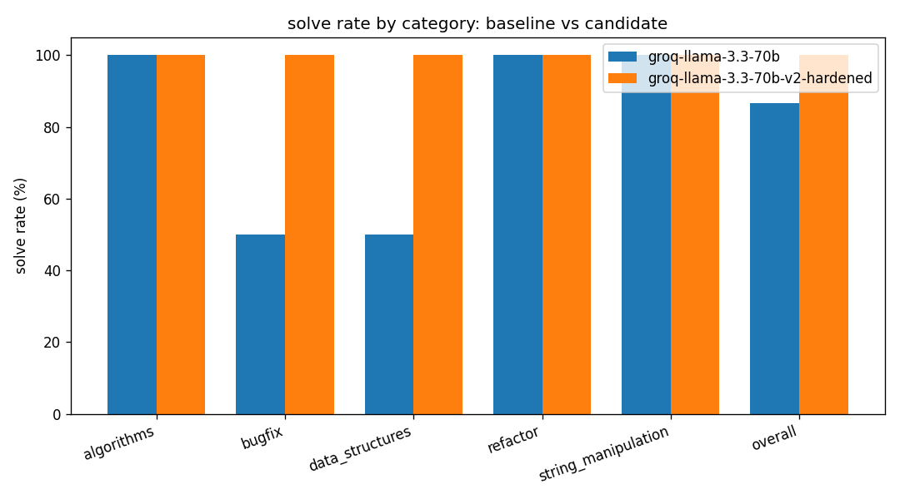
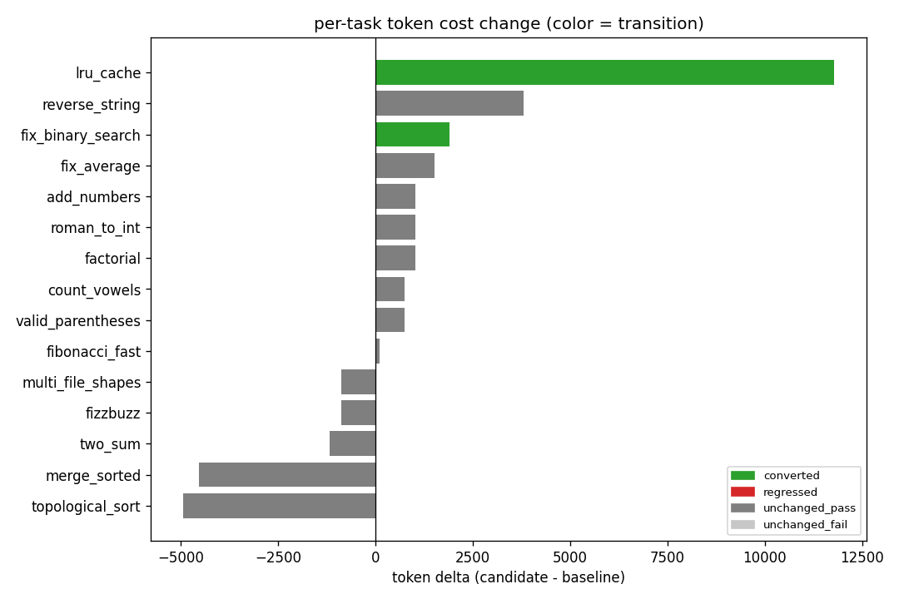

# M7 — Hardening Analysis (v1 → v2)

M6 ran the agent against the full `v1` benchmark on Llama 3.3 70B (Groq) and landed at
**86.7% (13/15)**, with two failures on hard tasks that broke for two *different* reasons:

- `fix_binary_search` — a subtly **`wrong_solution`**: the agent finished confidently on a fix
  that still failed the hidden suite.
- `lru_cache` — a protocol-level **`malformed_tool_call`**: the model's JSON tool calls never
  parsed, so it died on the consecutive-malformed cap **without ever executing a single tool**
  (its `tool_counts` in the v1 results is literally `{}`).

M7 targets exactly those two failure classes with two focused changes, then re-measures the
whole benchmark and diffs it against the M6 baseline. Raw results:
[`results/groq-llama-3.3-70b-v1.json`](results/groq-llama-3.3-70b-v1.json) (baseline) and
[`results/groq-llama-3.3-70b-v2.json`](results/groq-llama-3.3-70b-v2.json) (hardened).

## The two fixes

1. **Balanced-brace tool-call parser** (`e00693e`). The original extractor was a naive
   first-`{`-to-last-`}` slice that broke whenever the model wrapped a tool call in prose,
   emitted nested braces, or added a trailing token. It's replaced with a brace-matching scan
   that walks the response and pulls the first balanced `{...}` object, tolerant of surrounding
   text. This directly attacks the `malformed_tool_call` failure mode.

2. **Verified-finish gate** (`63c7e02`, wired through the CLI in `9acc200`). With
   `--require-verified-finish`, the agent may only call `finish` after it has **authored its own
   test file and watched it pass** in the sandbox. The loop refuses a `finish` that isn't backed
   by a green self-authored test. This attacks the `wrong_solution` failure mode — the agent can
   no longer declare victory on an unverified guess.

The diff itself is produced by a small comparison layer added in the same milestone: a
run-vs-run differ with regression detection (`d1c5a2d`), a CLI that exits non-zero if any task
regresses (`68c4b4f`), and the figures below (`e02deb7`).

## Headline

**Solve rate: 86.7% → 100.0% (+13.3%). Both M6 failures converted (fail → pass), zero
regressions.**



| Cut | v1 | v2 |
|---|---|---|
| **Overall** | 13 / 15 (86.7%) | **15 / 15 (100%)** |
| easy | 5 / 5 | 5 / 5 |
| medium | 5 / 5 | 5 / 5 |
| hard | **3 / 5** | **5 / 5** |
| bugfix | 1 / 2 | 2 / 2 |
| data_structures | 1 / 2 | 2 / 2 |

The two per-category dips that M6 flagged as small-N artifacts (bugfix and data_structures at
50%, each dragged down by its single hard task) both close to 100% — because those single hard
tasks *are* `fix_binary_search` and `lru_cache`.

## What actually changed, per task

The conversions aren't inferred from the score — they're visible in the v2 traces, and each
matches the fix that targeted it.

**`lru_cache`: malformed death → solved (both fixes).** In v1 the agent never got off the
ground: its first responses didn't parse and it hit the malformed cap with an empty tool log.
In v2 it runs **0 malformed steps** — the balanced-brace parser is the necessary unblock — and
then the verified-finish gate drives a write → test → iterate loop:

```
step0 write_file solution.py
step1 write_file test_solution.py     # self-test
step2 run_tests  -> fail (exit 2)
step3 write_file test_solution.py     # fixes its own test
step4 run_tests  -> fail (exit 2)
step5 write_file test_solution.py
step6 run_tests  -> PASS (exit 0)
step7 finish                          # only now allowed
```

**`fix_binary_search`: wrong_solution → solved (verified-finish gate).** The parser was never
this task's problem; the unverified guess was. Under the gate the agent writes its test *first*,
then the fix, then confirms green before finishing — the textbook behavior the gate is meant to
force:

```
step0 read_file  (the buggy source)
step1 write_file test_solution.py     # self-test, authored before the fix
step2 write_file solution.py          # the fix
step3 run_tests  -> PASS (exit 0)
step4 finish
```

## Per-task diff

Converted tasks first, then the unchanged-pass set in baseline order. No task regressed.

| Task | Cat | Diff | v1 | v2 | Transition | Δiters | Δtokens |
|---|---|---|:--:|:--:|---|--:|--:|
| `fix_binary_search` | bugfix | hard | ❌ wrong_solution | ✅ | ✅ **converted** | +1 | +1,895 |
| `lru_cache` | data_structures | hard | ❌ malformed_tool_call | ✅ | ✅ **converted** | +5 | +11,779 |
| `add_numbers` | algorithms | easy | ✅ | ✅ | — | +1 | +1,029 |
| `count_vowels` | string_manipulation | easy | ✅ | ✅ | — | +0 | +751 |
| `factorial` | algorithms | easy | ✅ | ✅ | — | +1 | +1,020 |
| `fizzbuzz` | algorithms | easy | ✅ | ✅ | — | -1 | -880 |
| `reverse_string` | string_manipulation | easy | ✅ | ✅ | — | +2 | +3,797 |
| `fibonacci_fast` | algorithms | hard | ✅ | ✅ | — | +0 | +102 |
| `multi_file_shapes` | refactor | hard | ✅ | ✅ | — | -1 | -876 |
| `topological_sort` | algorithms | hard | ✅ | ✅ | — | -3 | -4,940 |
| `fix_average` | bugfix | medium | ✅ | ✅ | — | +1 | +1,520 |
| `merge_sorted` | algorithms | medium | ✅ | ✅ | — | -1 | -4,544 |
| `roman_to_int` | string_manipulation | medium | ✅ | ✅ | — | +0 | +1,024 |
| `two_sum` | algorithms | medium | ✅ | ✅ | — | -1 | -1,177 |
| `valid_parentheses` | data_structures | medium | ✅ | ✅ | — | +0 | +745 |

## The cost of hardening

Reliability isn't free — the verified-finish gate makes the agent do more work per task.

| Metric | v1 | v2 | Δ |
|---|--:|--:|--:|
| Total tokens | 65,400 | 76,645 | **+11,245 (+17%)** |
| Total iterations | 74 | 78 | +4 |
| Wall-clock | 285 s | 353 s | +68 s |



Two things stand out in the token-delta chart:

- The **net +17% is dominated by `lru_cache` alone** (+11.8k). That task went from an instant
  malformed death (cheap, but a failure) to a full 8-iteration solve — so its cost *rose*
  precisely because it now does real work and succeeds. `fix_binary_search` converted for a
  modest +1.9k.
- The unchanged-pass tasks roughly **wash out**: several got *cheaper* (`topological_sort`
  −4.9k, `merge_sorted` −4.5k) while others rose by ~1k. With temperature 0 these are run-to-run
  drift, not a systematic tax — the gate adds a test-authoring round only when the agent wasn't
  already testing.

The behavioral shift shows in the aggregate tool mix: `write_file` 27 → 41 and `run_tests`
16 → 18 (the agent now authors and runs its own tests), while exploratory `read_file` (8 → 2)
and `list_dir` (6 → 2) fall away. `finish` goes 14 → 15 — every task now reaches a clean,
verified finish, including the one that previously died malformed.

## Honest caveats

- **Single attempt, n = 1 per version.** Each task is run once per configuration (no best-of-N),
  and while inference is `temperature=0`, the provider is not bit-for-bit deterministic. The
  per-task conversions are *explained by their traces above*, but a 15-task, single-shot diff is
  a characterization of behavior, not a statistical claim. The honest read is "both targeted
  failure modes were fixed and nothing regressed," not "+13.3% ± a confidence interval."
- **Provenance of this run.** v2 is a clean, complete run with **zero `provider_error`s**.
  Earlier hardened runs were discarded because Groq free-tier rate-limiting (429s) injected
  `provider_error`s mid-benchmark, which contaminate solve rate; only an uncontaminated run is
  comparable to the M6 baseline.
- **The gate verifies *self-authored* tests, not the hidden suite.** It forces the agent to
  write and pass *a* test before finishing; it can't see the grader. A model that writes a weak
  self-test could still finish on a wrong solution. It strictly narrows the `wrong_solution`
  surface — it doesn't eliminate it.

## How it was run

```bash
LLM_PROVIDER=groq DATABASE_URL="sqlite+aiosqlite:///eval.db" \
  uv run python -m app.eval.cli \
  --label groq-llama-3.3-70b-v2-hardened --create-tables --require-verified-finish

# diff against the M6 baseline (exits non-zero if any task regressed):
DATABASE_URL="sqlite+aiosqlite:///eval.db" uv run python -m app.eval.compare_cli \
  --baseline groq-llama-3.3-70b --candidate groq-llama-3.3-70b-v2-hardened
```

Model `llama-3.3-70b-versatile`, `temperature=0.0`, `max_tokens=1024`, `max_iterations=15`,
`max_consecutive_malformed=3`, single attempt per task; `SubprocessSandbox` with `unshare --net`
network isolation active; SQLite persistence.
